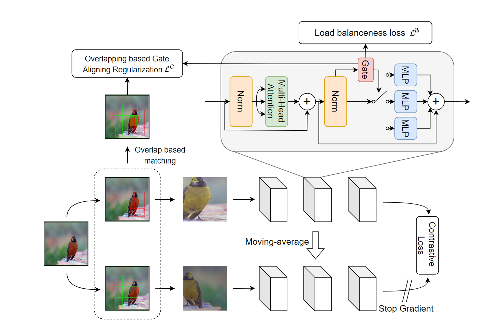

# CR-MoE: Consistent Routed Mixture-of-Experts for Scaling Contrastive Learning

## Introduction
While Contrastive Learning (CL) achieves great success in many downstream tasks, its good performance heavily relies on a large model capacity. As previous methods focus on scaling dense models, training and inference costs increase rapidly with model sizes, leading to large resource consumption. In this paper, we explore CL with an efficient scaling method, Mixture of Experts (MoE), to obtain a large but sparse model. We start by plugging in the state-of-the-art CL method to MoE. However, this naive combination fails to visibly improve performance despite a much larger capacity. A closer look reveals that the naive MoE+CL model has a strong tendency to route two augmented views of the same image token to different subsets of experts: such ``cross-view instability" breaks the weight-sharing nature in CL and misleads the invariant feature learning. To address this issue, we introduce a new regularization mechanism, by enforcing expert-routing similarity between different views of the same image (or its overlapped patch tokens), while promoting expert-routing diversity of patches from different images. The resultant method, called CR-MoE, improves by 1.7 points in terms of 1\% semi-supervised learning accuracy on ImageNet, compared to the naive combination baseline. It further surpasses the state-of-the-art CL methods on ImageNet pre-training of Vision Transformer (ViT) by 2.8 points, at the same computational cost. Our findings validate CR-MoE as an effective and efficient image representation learner. Code is included in the supplemental materials.

## Method


## Environment Setting
```shell
conda create -n crmoe python=3.6 -y
conda activate crmoe
conda install pytorch==1.8.0 torchvision==0.9.0 torchaudio==0.8.0 cudatoolkit=11.1 -c pytorch -c conda-forge -y

# fastmoe v0.3.0
git clone https://github.com/laekov/fastmoe.git
cd fastmoe
git checkout 4edeccd95a66d1f2d5eb7ec7a9e40a9f67e0e393
psudo() { sudo env PATH="$PATH" "$@"; }
psudo python setup.py install
pip install dm-tree
pip install tensorboard tensorboardX
pip install timm==0.3.2
```

## Pretrain Cmds
Available at [cmds/execute_hist](cmds/execute_hist). Finetuning would be executed automatically after pre-training.

Pretrained Model for vit-s can be find at [here](https://www.dropbox.com/scl/fo/g0itaju6rdg7nb0zcdyv8/h?rlkey=ngkqqs0k0nzrnxsfgqu7k4762&dl=0).


## Acknowledge
Partial of this code comes from [MocoV3](https://github.com/facebookresearch/moco-v3), [FastMoE](https://github.com/laekov/fastmoe) and [Deit](https://github.com/facebookresearch/deit).
